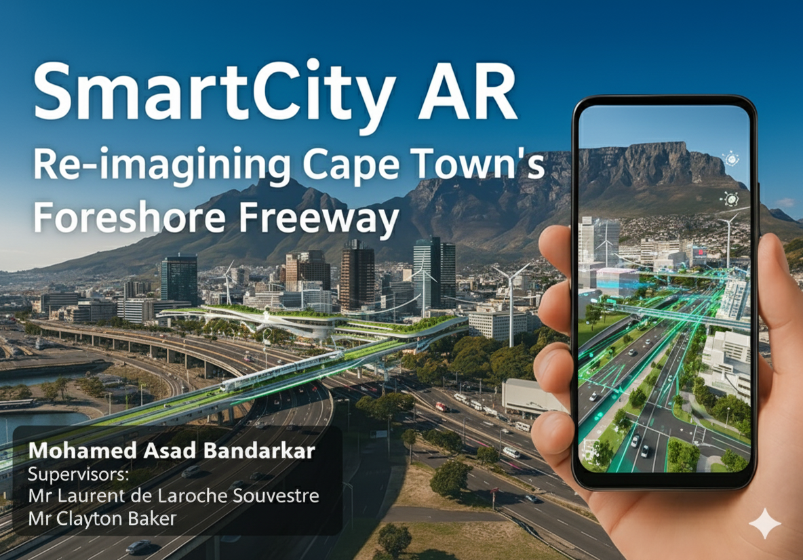
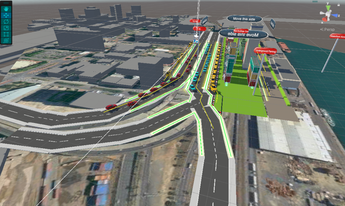
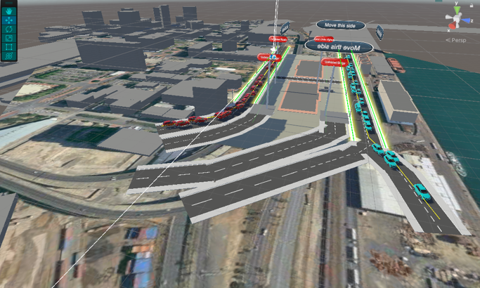

# 🌆 SmartCity AR
**An Augmented Reality viewer for sustainable urban planning in Cape Town’s Foreshore Freeway Precinct**
Google Sites Link: https://sites.google.com/myuwc.ac.za/smartcityar-masad-bandarkar/home 


---

## 🏙️ Overview
SmartCity AR is an **Augmented Reality (AR)** application designed to help visualize urban planning proposals for **Cape Town’s Foreshore Freeway Precinct** — an area affected by traffic congestion, poor pedestrian access, and underutilized spaces.

Traditional 2D maps and static diagrams fail to capture how different infrastructure systems interact in three dimensions. SmartCity AR bridges this gap by allowing **planners, architects, students, and the public** to explore 3D planning scenarios **interactively in real-world context**.

---

## 🎯 Project Goal
To develop an AR-based visualization tool that allows users to:

* **Compare** Sustainable vs Unsustainable planning scenarios.
* **Toggle** individual infrastructure layers such as roads, electricity, and water.
* **Simulate** traffic flow across major routes.
* **View** contextual information about city structures and proposed improvements.

---

## 🧠 Problem Statement
Cape Town’s Foreshore Freeway Precinct suffers from:

* **Chronic traffic congestion**,
* **Underutilized highway structures**, and
* **Limited pedestrian accessibility**.

Urban planning proposals are difficult to interpret because static tools can’t show 3D spatial relationships or mobility interactions. SmartCity AR provides an **interactive, immersive solution** to visualize and evaluate different urban design strategies.

---

## 🧩 Features
### 🔹 Functional Features
| Feature | Description |
| :--- | :--- |
| **Toggle Scenarios** | ✅ Toggle between Sustainable and Unsustainable scenarios. |
| **Layer Control** | ✅ Enable/disable infrastructure layers — Roads, Electricity, Water. |
| **Traffic Simulation** | ✅ View realistic traffic flow simulation using object pooling. |
| **Model Navigation** | ✅ Navigate the model using camera focus buttons. |
| **Contextual Info** | ✅ Interactive info buttons for contextual pop-ups. |
| **Reset** | ✅ Reset functionality to return to the main menu. |

### 🔹 Non-Functional Features
* **Performance:** ⚡ Fast scene load time (average: 4.8 seconds).
* **Frame Rate:** 🎮 Smooth performance at 30–46 FPS on mid-range Android devices.
* **Usability:** 📱 Mobile-friendly UI with large, accessible touch buttons.
* **Architecture:** 🏗️ Modular architecture for scalability and easy feature additions.

---

## 🏗️ System Architecture
The architecture follows a modular, layered design to separate UI, AR logic, and simulation systems for scalability and maintainability.

### Core Components
| Component | Description |
| :--- | :--- |
| `ARAppController.cs` | Controls AR initialization and scene management. |
| `UIController.cs` | Handles user input (toggles, buttons, navigation). |
| `SceneManager.cs` | Manages loading and visibility of infrastructure layers. |
| `RoadPath.cs` | Defines waypoints for vehicle movement. |
| `TrafficSpawner.cs` | Uses object pooling for efficient traffic simulation. |
| `CameraMoveTrigger.cs` | Handles camera transitions to key points of interest. |

---

## 🛠️ Tech Stack
| Layer | Technology |
| :--- | :--- |
| **Engine** | Unity 2022 |
| **Language** | C# |
| **AR Framework** | AR Foundation (ARCore compatible) |
| **3D Modeling** | Blender + Blender GIS (OpenStreetMap integration) |
| **Version Control** | Git + GitHub |
| **Target Platform** | Android (ARCore-supported devices) |

---

## 🧪 Testing
| Test Type | Focus | Outcome | Future Optimization |
| :--- | :--- | :--- | :--- |
| **Functional Testing** | Infrastructure toggles, camera navigation, scenario switching | ✅ Passed | N/A |
| **Performance Testing** | Scene load time, FPS consistency | ✅ Passed | N/A |
| **Edge Cases** | All layers + full traffic on entry-level device | ⚠️ Slight FPS drop below 30 | Implement Level-of-Detail (LOD) for traffic vehicles 🚀 Planned |

---

## 📱 How to Run
### 🔧 Requirements
* Unity 2022 or later
* Android device with ARCore support
* USB cable for device deployment

### ⚙️ Setup Steps
1.  **Clone the repository**
    ```bash
    git clone [https://github.com/](https://github.com/)<your-username>/SmartCity-AR.git
    cd SmartCity-AR
    ```
2.  Open the project in **Unity 2022**.
3.  Ensure **AR Foundation** and **ARCore XR Plugin** are installed via the Package Manager.
4.  Go to **Build Settings** → **Android** → **Build & Run**.
5.  Launch the app on your AR-supported device.

---

## 📸 Screenshots / Demo
| Sustainable View | Unsustainable View | Traffic Simulation |
| :---: | :---: | :---: |
|  |  | |

## 📚 References
* OpenStreetMap Data via Blender GIS
* Unity AR Foundation Documentation
* City of Cape Town – Foreshore Freeway Precinct Redevelopment Reports

---

## 💡 Future Work
* Add **real-time traffic data integration**.
* Implement **LOD (Level of Detail) optimization** for better performance.
* Develop a **web-based AR viewer** for accessibility without an app.
* Integrate **multi-user collaboration** using cloud anchors.

---

## 🧑‍💻 Author
**Mohamed Asad Bandarkar**

* 📍 University of the Western Cape – BSc Honours Computer Science
* 📧 [mohamedasad11914@gmail.com]
* 🔗 [LinkedIn Profile](https://www.linkedin.com/in/mabandarkar/) |

---
